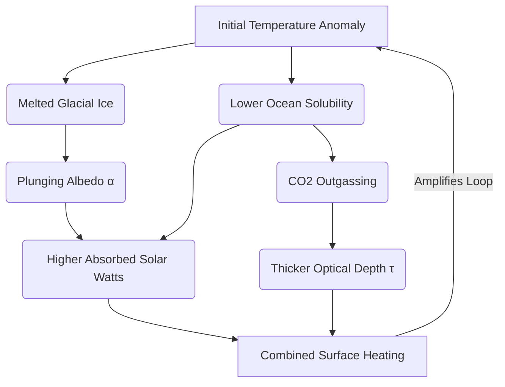

# Coupled Planetary Physics Simulation & ML Interactive Web Dashboard

🌐 **Live Interactive Web App:** [Launch Live Streamlit Dashboard](https://planetary-climate-dashboard-39fa7nlk7sshwsuzsyskjd.streamlit.app/)

An interactive, production-grade data science application that unifies **atmospheric radiative transfer**, **aquatic geochemistry**, and **cryospheric thermodynamics**. This system bypasses hardcoded inputs by streaming live, globally averaged atmospheric telemetry from the **NOAA Global Monitoring Laboratory** and uses Machine Learning to predict future climate scenarios.

---

## 📐 The Physics Under the Hood: Mathematical Blueprint

The application dynamically couples three independent planetary sub-systems using rigorous thermodynamic, radiative, and predictive equations:

### 1. Longwave Emission & Radiative Transfer (Graph 1)
The baseline planetary thermal footprint is mapped using **Planck's Law**, determining spectral radiance ($B_\lambda$) across infrared cooling channels:

$$B_\lambda(\lambda, T) = \frac{2hc^2}{\lambda^5 \left( e^{ \frac{hc}{\lambda k_B T} } - 1 \right)}$$

Greenhouse gas absorption is resolved via the **Beer-Lambert Law**. The major $CO_2$ bending vibration mode at $15\ \mu\text{m}$ is modeled using a localized Gaussian line-shape cross-section to accurately capture out-of-band energy profiles:

$$I_{\text{observed}}(\lambda) = I_{\text{surface}}(\lambda) \cdot e^{-\tau(\lambda)} + I_{\text{atmosphere}}(\lambda) \cdot (1 - e^{-\tau(\lambda)})$$

### 2. Aquatic Carbon Outgassing (Graph 2)
The ocean's capacity to retain greenhouse gases drops as water temperature rises. This phase shift is governed by **Henry's Law**, with its exponential temperature dependency derived through the **Van 't Hoff equation**:

$$k(T) = k_\theta \times \exp\left[ C \left(\frac{1}{T} - \frac{1}{T_\theta}\right) \right]$$

The system calculates total mass shifts over an active upper ocean mixed layer volume ($V_{\text{ocean}} = 1.6 \times 10^{21}\text{ Liters}$), tracking the absolute outgassed carbon pool in **Gigatons (Gt)**.

### 3. Shortwave Solar Absorption & Ice Albedo (Graph 3)
To balance the planetary energy budget, the cryosphere models non-linear ice-sheet decay through a continuous **logistic activation curve**:

$$f_{\text{ice}}(T) = \frac{1}{1 + e^{k_{\text{melt}}(T - T_{\text{melt}})}}$$

$$\alpha_{\text{planetary}} = f_{\text{ice}} \cdot \alpha_{\text{ice}} + (1 - f_{\text{ice}}) \cdot \alpha_{\text{ocean}}$$

$$S_{\text{absorbed}} = S_0 \cdot (1 - \alpha_{\text{planetary}})$$

As reflective ice ($\alpha = 0.75$) melts, it uncovers dark open ocean ($\alpha = 0.08$), causing solar energy absorption to spike from $\sim 244\text{ W/m}^2$ to over $\sim 298\text{ W/m}^2$.

---

## 🧠 Machine Learning Integration

The dashboard incorporates a dual-layer Machine Learning pipeline:
* **Predictive Forecasting (Regression):** A Scikit-Learn `PolynomialFeatures(degree=2)` wrapped inside a `LinearRegression` engine ingests the live historical NOAA data feed (from 1980 to the present) to project future carbon paths out to the year 2060.
* **Tipping Point Classification (Random Forest):** A `RandomForestClassifier` samples hundreds of randomized climate scenarios to map out systemic thresholds. This models a clear boundary line separating a stable ecosystem from a runaway greenhouse crash.

### 🔄 The Amplifying Feedback Loop

---

## 📄 License & Copyright

> ⚠️ **IMPORTANT COPYRIGHT NOTICE**
> 
> **All Rights Reserved © 2026 T A Srinivas.**
> This repository is strictly for portfolio viewing purposes. **DO NOT COPY, CLONE, OR REDISTRIBUTE** this code. Stolen copies or unauthorized forks will be reported immediately for a GitHub copyright takedown.

* **Lead Architect & Developer:** [Srinivasta](https://github.com/SRINIVASTA)

### 🌐 Let’s Connect

-   
-   
-   
- 
- 
